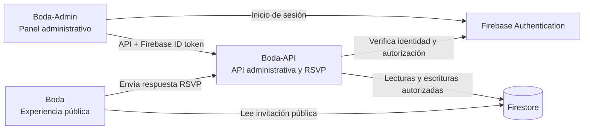

# Boda-Admin

Panel web para administrar las invitaciones digitales de Boda. Permite al equipo autorizado crear y organizar invitaciones, mantener la lista de personas y consultar las respuestas RSVP registradas por la experiencia pública.

Este repositorio contiene la aplicación administrativa. La experiencia de los invitados está en **Boda** y las operaciones protegidas y reglas de negocio están en **Boda-API**.

## 1. Funcionalidades

- Dashboard con métricas de invitaciones y seguimiento de RSVP, capacidad y actividad reciente.
- Listado de invitaciones activas y archivadas, búsqueda, filtros y paginación.
- Creación de invitaciones con personas conocidas, espacios abiertos y configuración de sustituciones.
- Detalle y administración de una invitación: edición de nombres, ajustes de lugares, sustituciones, permisos extraordinarios de RSVP, archivo y restauración.
- Consulta de las personas y sus respuestas: asistirán, no asistirán o todavía no han respondido, según la información recibida desde la API.
- Generación y copia del enlace público de cada invitación.
- Importación de invitaciones desde Excel, con validación y vista previa antes de confirmar la creación.

Las acciones están disponibles para usuarios autorizados por Boda-API; iniciar sesión por sí solo no concede acceso administrativo.

## 2. Arquitectura



Boda-Admin no consulta Firestore directamente. Para las peticiones administrativas obtiene el ID token del usuario autenticado y lo envía a Boda-API como `Bearer`; la API valida el token y comprueba que el UID esté autorizado. La aplicación pública Boda presenta la invitación al invitado y comunica las respuestas RSVP a la API.

## 3. Tecnologías

- React 19, TypeScript y Vite 8.
- React Router para las rutas de la aplicación.
- Firebase Authentication para el inicio de sesión.
- Tailwind CSS 4 y estilos propios.
- Vitest, Testing Library y jsdom para pruebas unitarias.
- Oxlint para lint.
- SheetJS (`xlsx`) para leer archivos de importación.

Las versiones concretas están declaradas en `package.json` y `package-lock.json`.

## 4. Requisitos e instalación local

Se requiere Node.js 24 (la versión usada por CI), npm y acceso a una instancia de Boda-API. Para una instalación reproducible:

```bash
npm ci
```

Configura las variables de entorno descritas a continuación en un archivo `.env.local` o en el entorno de la terminal. No subas credenciales ni archivos de entorno locales al repositorio.

```bash
npm run dev
```

Vite muestra en la terminal la dirección local donde sirve el panel. Para trabajar con el sistema integrado de emuladores, usa el procedimiento de la sección 7.

## 5. Variables de entorno

Las variables reconocidas están definidas en `src/config/env.ts`; los nombres también aparecen en `.env.example`. No se incluyen valores de proyecto o credenciales en esta documentación.

| Variable | Uso |
| --- | --- |
| `VITE_FIREBASE_API_KEY` | Configuración de Firebase Authentication fuera del modo de emuladores. |
| `VITE_FIREBASE_AUTH_DOMAIN` | Dominio de autenticación de Firebase fuera del modo de emuladores. |
| `VITE_FIREBASE_PROJECT_ID` | Proyecto Firebase fuera del modo de emuladores. |
| `VITE_FIREBASE_STORAGE_BUCKET` | Configuración de Firebase requerida por la inicialización de la app fuera del modo de emuladores. |
| `VITE_FIREBASE_MESSAGING_SENDER_ID` | Configuración de Firebase requerida por la inicialización de la app fuera del modo de emuladores. |
| `VITE_FIREBASE_APP_ID` | Configuración de Firebase requerida por la inicialización de la app fuera del modo de emuladores. |
| `VITE_API_BASE_URL` | URL base de Boda-API; es obligatoria para realizar peticiones. |
| `VITE_PUBLIC_INVITATION_BASE_URL` | Origen de la aplicación pública Boda, usado para construir los enlaces de invitación. |
| `VITE_USE_FIREBASE_EMULATORS` | Activa el modo local únicamente con el valor `true` y solo durante desarrollo. Si se omite, el modo de emuladores queda desactivado. |

En el modo normal, se requieren las seis variables `VITE_FIREBASE_*`, además de las URLs de API y de Boda. En modo emulador, Firebase usa configuración local de demostración; la API y el origen público deben apuntar a loopback. El código valida estas condiciones antes de iniciar.

Todas las variables `VITE_*` se incorporan al código que recibe el navegador. No pongas secretos en ellas. La autorización administrativa se decide en el backend, no por ocultar datos en el frontend.

## 6. Inicio de sesión, permisos y API

El acceso comienza en `/login` mediante Firebase Authentication. Las rutas administrativas están protegidas por el proveedor de autenticación y `ProtectedRoute`: sin sesión se presenta el inicio de sesión; mientras se valida el acceso se muestra el estado de carga y, si la API rechaza al usuario o no está disponible, se informa el estado correspondiente.

El cliente HTTP obtiene el ID token actual de Firebase y lo adjunta a cada petición protegida. Boda-API verifica el token y autoriza los UID configurados para administración. Por eso, poder autenticarse en Firebase no implica necesariamente tener permisos para el panel.

Rutas principales definidas en `src/routes/AppRoutes.tsx`:

- `/` — Dashboard.
- `/invitaciones` — invitaciones.
- `/invitaciones/archivadas` — invitaciones archivadas.
- `/invitaciones/nueva` — crear invitación.
- `/invitaciones/importar` — importación Excel.
- `/invitaciones/:id` — detalle y administración.

## 7. Firebase Emulator

El modo local de esta aplicación se habilita con `VITE_USE_FIREBASE_EMULATORS=true`. Está limitado a desarrollo, usa el proyecto de demostración `demo-boda` y conecta Firebase Authentication al emulador local. Boda-Admin no se conecta directamente al emulador de Firestore; Boda-API es quien accede a Firestore.

Para el entorno integrado, primero sigue la guía **`docs/local-emulator.md` del repositorio Boda**: allí se describe cómo iniciar Firestore Emulator, Auth Emulator, Boda-API, Boda y Boda-Admin usando el proyecto explícito `demo-boda`. En la terminal de Boda-Admin, la configuración local de esta aplicación es:

```powershell
$env:VITE_USE_FIREBASE_EMULATORS = 'true'
$env:VITE_API_BASE_URL = 'http://127.0.0.1:3000'
$env:VITE_PUBLIC_INVITATION_BASE_URL = 'http://127.0.0.1:5173'
npm run dev -- --host 127.0.0.1 --port 5174 --strictPort
```

Estas variables de PowerShell duran solo en esa sesión. La guía de Boda contiene el orden de arranque, los puertos del resto del entorno y el procedimiento para detenerlo. No uses esta configuración con servicios reales.

## 8. Pruebas y validaciones

Comandos definidos por el proyecto:

```bash
npm test
npm run lint
npm run build
```

`npm test` compila la configuración de TypeScript para pruebas y ejecuta Vitest. Las pruebas unitarias del repositorio están junto a las funcionalidades o en los archivos de prueba correspondientes. El workflow `.github/workflows/ci.yml` instala dependencias con `npm ci` y ejecuta lint, pruebas y build en pull requests y cambios a `main`.

Los recorridos E2E de Playwright están en el repositorio **Boda**, bajo `scripts/e2e/`, y no en este repositorio. Cubren un recorrido integrado entre administración, invitación pública y API en emuladores, incluyendo creación, RSVP, sustitución y restauración. Para ejecutarlos, levanta antes el entorno siguiendo `Boda/docs/local-emulator.md` y, desde Boda, ejecuta el comando definido allí:

```bash
npm run test:e2e
```

## 9. Importar invitaciones desde Excel

Desde `/invitaciones/importar`, el archivo se lee, valida y previsualiza localmente. La importación solo se confirma si todas las filas son válidas. Después se guarda una sesión en IndexedDB y las invitaciones se crean secuencialmente con claves idempotentes; el proceso se detiene ante el primer fallo y no hace rollback ni reintentos automáticos.

Al volver a la página, **Continuar importación** recupera la sesión y reconcilia resultados con las mismas claves. La sesión pertenece al navegador y origen local; no es una copia de seguridad entre dispositivos. Descartarla elimina el estado local, y volver a importar el mismo archivo puede crear duplicados. La guía detallada está en [`docs/invitation-import.md`](docs/invitation-import.md).

El archivo Excel usa la hoja **Invitaciones** y una fila por invitación. La plantilla contiene columnas para invitación, espacios abiertos, sustituciones y personas; las instrucciones y ejemplos de plantilla no se importan. Para generar la plantilla vacía descargable:

```bash
npm run template:invitations
```

## 10. Estructura principal

```text
src/
├── app/                    # Arranque y configuración de la aplicación
├── auth/                   # Contexto, servicios y protección de acceso
├── config/                 # Variables de entorno y Firebase
├── features/
│   ├── dashboard/          # Panel y métricas
│   └── invitations/        # Listado, creación, detalle e importación
├── layouts/                # Estructura visual compartida
├── routes/                 # Definición de rutas
├── services/http/          # Cliente HTTP y manejo de errores de API
└── shared/                 # Componentes y utilidades compartidos
docs/                       # Documentación funcional
scripts/                    # Utilidades locales del proyecto
```

## 11. Build y despliegue

El build de producción se genera en `dist/`:

```bash
npm run build
```

Para previsualizar localmente el resultado:

```bash
npm run preview
```

El repositorio no define un comando ni una configuración de despliegue. El destino de hosting, las variables del entorno desplegado y el proceso de publicación deben configurarse en la infraestructura correspondiente; no se asumen aquí.

## 12. Fase 1 y limitaciones conocidas

Boda-Admin implementa la parte administrativa de la gestión de invitaciones y seguimiento RSVP de la Fase 1, junto con Boda y Boda-API. Su alcance es administrar invitaciones, personas, capacidad y permisos relacionados con la respuesta. No es un módulo de planificación integral de bodas; presupuesto, proveedores, tareas y otros módulos de Wending quedan fuera de este repositorio.

Limitaciones verificables del proyecto:

- El Dashboard carga información de la API al entrar o volver a cargar la vista; no mantiene una suscripción en tiempo real.
- La sesión de una importación Excel se conserva en IndexedDB del navegador y origen actuales; no ofrece recuperación entre dispositivos ni rollback de invitaciones ya creadas.
- La suite E2E integrada reside en Boda y requiere los tres proyectos y los emuladores locales.
- Este repositorio no incluye configuración de despliegue; el hosting debe documentarse en su infraestructura cuando se defina.
